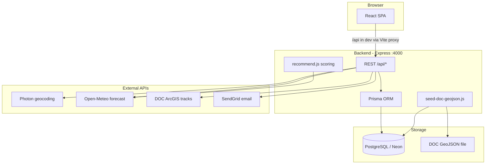

# MōkuCamp

MōkuCamp takes its name from the Māori word **mōku**, meaning “for me” — a web application that recommends New Zealand camping locations based on the user’s trip location, dates, landscape and activity preferences, and facility needs.

**Live demo:** [https://mokucamp.vercel.app/](https://mokucamp.vercel.app/)

---

## Table of contents

1. [What the application does](#what-the-application-does)
2. [Technology stack](#technology-stack)
3. [Repository layout](#repository-layout)
4. [Architecture](#architecture)
5. [Data model](#data-model)
6. [Getting started (local development)](#getting-started-local-development)
7. [REST API reference](#rest-api-reference)
8. [Recommendation logic](#recommendation-logic)
9. [Testing](#testing)
10. [Third-party services and data attribution](#third-party-services-and-data-attribution)
11. [Deployment notes](#deployment-notes)
12. [License](#license)

---

## What the application does

### Main user flows

| Flow | Description |
|------|-------------|
| **Search & map** | User enters a New Zealand location (geocoded), trip date, radius, landscape/activity preferences, and facility filters. Results appear on a Leaflet map as interactive markers. |
| **Recommendations** | With a valid `lat`, `lon`, and `radiusKm`, the backend ranks campsites by a weighted score (distance, weather, landscape, activities). Without location, campsites are filtered only (no ranking score). |
| **Campsite detail** | Clicking a campsite shows DOC-sourced details, a day forecast (Open-Meteo), nearby DOC walking tracks, and user reviews. |
| **Authentication** | Register, email verification, login (JWT). Password reset via email. |
| **Shortlist** | Logged-in users save campsites; guest shortlist is stored in the browser and can be synced to the server after login. |
| **Reviews** | Logged-in users can post one review per campsite (rating 1–5 + text). Public read with pagination. |
| **Profile** | `/profile` — change password, view/edit username, manage reviews (protected route). |

### Frontend routes

| Path | Page | Auth |
|------|------|------|
| `/` | Home — search form, map, recommendations | Public |
| `/verify-email` | Email verification handler | Public |
| `/reset-password` | Password reset form | Public |
| `/profile` | User profile | JWT required |

---

## Technology stack

| Layer | Technologies |
|-------|----------------|
| **Frontend** | React 19, Vite 7, React Router 7, Tailwind CSS 4, Leaflet / react-leaflet |
| **Backend** | Node.js, Express 5, Prisma 5, PostgreSQL (Neon in production) |
| **Auth** | JWT (`jsonwebtoken`), bcrypt password hashing |
| **Email** | SendGrid (production) or Ethereal preview URLs (local dev without API key) |
| **Tests** | Jest + Supertest (backend), Vitest + Testing Library (frontend) |

---

## Repository layout

```
mokucamp/
├── README.md                 # This file
├── backend/                  # Express API + Prisma
│   ├── server.js             # Entry: loads .env, listens on PORT (default 4000)
│   ├── src/app.js            # Express app, CORS, route mounting
│   ├── src/routes/           # API route handlers
│   ├── src/utils/            # Campsite helpers, weather, geo, scoring
│   ├── src/services/         # Email, DOC tracks (ArcGIS)
│   ├── prisma/schema.prisma  # Database schema
│   └── tests/                # Jest integration tests
├── frontend/                 # React SPA
│   ├── src/pages/            # HomePage, ProfilePage, ResetPasswordPage
│   ├── src/components/       # Map, search form, drawers, auth UI
│   ├── src/hooks/            # Custom React hooks (auth, campsites, shortlist, reviews, nearby trails, …)
│   └── vite.config.js        # Dev proxy: /api → http://localhost:4000
├── data/geojson/
│   └── DOC_Campsites_202602.geojson   # Source dataset for seeding
└── docs/
    └── COORDINATE_VERIFICATION.md     # NZTM2000 → WGS84 conversion checks
```

---

## Architecture



### Request flow (typical search)

1. User types a place name → `GET /api/geocode?q=...` → Photon returns NZ coordinates.
2. User submits search → `GET /api/recommend?lat&lon&radiusKm&date&landscapes&activities&...` (or `GET /api/campsites` for unranked browse).
3. Backend queries PostgreSQL, optionally fetches Open-Meteo per candidate for weather scoring, returns JSON.
4. Frontend renders markers on Leaflet map (top picks highlighted separately).
5. Campsite click → `GET /api/campsites/:id`, `GET /api/forecast`, `GET /api/campsites/:id/nearby-tracks`, `GET /api/reviews/:campsiteId`.

### Authentication

- After login/register, the client stores a JWT and sends `Authorization: Bearer <token>` on protected routes.
- Middleware: `backend/src/middleware/authenticate.js` validates the token and sets `req.user = { id, email }`.

---

## Data model

Defined in `backend/prisma/schema.prisma`:

| Model | Purpose | Key relationships |
|-------|---------|-------------------|
| **User** | Account (email, password hash, email verification, reset tokens) | Has many `ShortlistItem`, `Review` |
| **Campsite** | One DOC campsite row (name, region, facilities, lat/lon, landscape, activities, …) | Unique on `(dataset, sourceId)`; has many reviews/shortlist entries |
| **ShortlistItem** | User ↔ campsite bookmark | Unique per `(userId, campsiteId)` |
| **Review** | User rating + text for a campsite | Unique per `(userId, campsiteId)` — upsert on POST |

Campsite coordinates are stored as **WGS84** `lat` / `lon`, converted from DOC’s NZTM2000 (EPSG:2193) during import. See [docs/COORDINATE_VERIFICATION.md](docs/COORDINATE_VERIFICATION.md) for sample verification.

### Importing campsite data

```bash
cd backend
npm run seed:doc-geojson
```

This reads `data/geojson/DOC_Campsites_202602.geojson`, converts coordinates, derives facility flags, and upserts rows into PostgreSQL.

---

## Getting started (local development)

### Prerequisites

- **Node.js** 18+ (LTS recommended)
- **PostgreSQL** — we use [Neon](https://neon.tech) (free tier); a local Postgres instance also works
- Optional: **SendGrid** API key for real emails (without it, verification/reset links are printed in the backend console via Ethereal)

### 1. Backend

```bash
cd backend
cp .env.example .env
# Edit .env — at minimum set DATABASE_URL and JWT_SECRET
npm install
npx prisma migrate dev    # apply migrations
npm run seed:doc-geojson  # load DOC campsites (first-time setup)
npm run dev               # http://localhost:4000
```

**Environment variables** (see `backend/.env.example`):

| Variable | Required | Purpose |
|----------|----------|---------|
| `DATABASE_URL` | Yes | PostgreSQL connection string |
| `JWT_SECRET` | Yes | Signs login tokens |
| `JWT_EXPIRES_IN` | No | Token lifetime (default `7d`) |
| `FRONTEND_URL` | No | CORS allowed origin(s); comma-separated. Default dev: `http://localhost:5173` |
| `EMAIL_SENDGRID_API_KEY` | No | Empty → Ethereal test inbox (links in server log) |
| `EMAIL_FROM` | No | From address when using SendGrid |
| `TEST_DATABASE_URL` | For tests | Separate Neon branch or DB (direct URL, not pooler) |

Health check: `GET http://localhost:4000/health` → `{ "status": "ok" }`

### 2. Frontend

```bash
cd frontend
npm install
npm run dev    # http://localhost:5173
```

In development, **no `VITE_API_URL` is needed**: Vite proxies `/api/*` to `http://localhost:4000` (see `frontend/vite.config.js`).

For production builds, set `VITE_API_URL` to the deployed backend origin (e.g. `https://your-api.onrender.com`).

### 3. Verify the stack

1. Open http://localhost:5173
2. Search for a NZ location (e.g. “Queenstown”)
3. Confirm campsites appear on the map
4. Optional: register a user and check the backend console for the verification email preview URL

---

## REST API reference

Base URL in development: `http://localhost:4000` (or relative `/api/...` through the Vite proxy).

Protected routes require header: `Authorization: Bearer <jwt>`.

### Health

| Method | Path | Auth | Description |
|--------|------|------|-------------|
| GET | `/health` | No | `{ status: "ok" }` |

### Auth — `/api/auth`

| Method | Path | Auth | Body / query | Notes |
|--------|------|------|--------------|-------|
| POST | `/register` | No | `{ email, password }` | Sends verification email |
| POST | `/login` | No | `{ email, password }` | Returns JWT; requires verified email |
| GET | `/verify-email` | No | `?token=` | Activates account |
| POST | `/resend-verification` | No | `{ email }` | Rate limited |
| POST | `/forgot-password` | No | `{ email }` | Sends reset link |
| POST | `/reset-password` | No | `{ token, password }` | |
| POST | `/change-password` | Yes | `{ currentPassword, newPassword }` | |
| GET | `/me` | Yes | — | Current user profile |
| PATCH | `/profile` | Yes | `{ username }` | |

### Campsites — `/api/campsites`

| Method | Path | Auth | Query params | Description |
|--------|------|------|--------------|-------------|
| GET | `/` | No | See below | List/filter campsites |
| GET | `/:id` | No | — | Single campsite |
| GET | `/:id/nearby-tracks` | No | `radiusKm`, `limit` | DOC walking routes near campsite |

**`GET /api/campsites` query parameters:**

| Param | Description |
|-------|-------------|
| `lat`, `lon`, `radiusKm` | Optional distance filter (Haversine) |
| `region`, `category` | Exact match filters |
| `q` | Text search (name, place, region, access) |
| `landscape`, `activity` | Comma-separated; campsite must include **all** tokens |
| `dogsAllowedBool`, `hasToilets`, `hasWater`, `hasPower` | `"true"` / `"false"` |
| `limit`, `offset` | Pagination (default limit 312, max 500) |

Response: `{ data: [...], total, ... }` (public campsite objects omit internal fields).

### Recommend — `/api/recommend`

| Method | Path | Auth | Description |
|--------|------|------|-------------|
| GET | `/` | No | Filter and optionally rank campsites |

**Query parameters:**

| Param | Description |
|-------|-------------|
| `lat`, `lon`, `radiusKm` | If all valid → distance filter + ranking mode |
| `date` | `YYYY-MM-DD` — weather score uses Open-Meteo for that day |
| `landscapes`, `activities` | Comma-separated; hard filter (must match all) |
| `dogsAllowedBool`, `hasToilets`, `hasWater`, `hasPower` | `"true"` = required |
| `limit` | Max ranked results (default 5, max 50) |

- **With location:** returns top-N by composite score, `ranked: true`, each item includes `score` and `distanceKm`.
- **Without location:** returns all matching filters, `ranked: false`, `score: null`.

### Geocode — `/api/geocode`

| Method | Path | Auth | Query | Description |
|--------|------|------|-------|-------------|
| GET | `/` | No | `q` (min 3 chars) | Up to 5 NZ results: `[{ displayName, lat, lon }]` via Photon |

### Forecast — `/api/forecast`

| Method | Path | Auth | Query | Description |
|--------|------|------|-------|-------------|
| GET | `/` | No | `lat`, `lon`, `date` | Single-day Open-Meteo daily payload |

### Shortlist — `/api/shortlist`

| Method | Path | Auth | Description |
|--------|------|------|-------------|
| GET | `/` | Yes | List user’s shortlisted campsites |
| POST | `/sync` | Yes | Body `{ ids: number[] }` — merge guest IDs into server list |
| POST | `/:campsiteId` | Yes | Add one campsite |
| DELETE | `/` | Yes | Clear entire shortlist |
| DELETE | `/:campsiteId` | Yes | Remove one item |

### Reviews — `/api/reviews`

| Method | Path | Auth | Description |
|--------|------|------|-------------|
| GET | `/mine` | Yes | All reviews by current user |
| GET | `/:campsiteId` | No | Paginated reviews + aggregate stats (`?page=1`) |
| POST | `/:campsiteId` | Yes | Body `{ rating: 1-5, content }` — upsert |
| DELETE | `/:campsiteId` | Yes | Delete own review |

---

## Recommendation logic

Implemented in `backend/src/routes/recommend.js`.

When `lat`, `lon`, and `radiusKm` are provided:

1. **Candidate selection** — bounding-box query on `lat`/`lon`, then precise Haversine filter within `radiusKm`.
2. **Hard filters** — facilities (`dogsAllowedBool`, toilets, water, power); landscape and activity tags (campsite must contain all selected values).
3. **Scoring** (weighted average of available dimensions):
   - **Distance** — linear decay from 1.0 at centre to 0.0 at radius edge
   - **Weather** — Open-Meteo daily data for `date`: good / fair / poor heuristics (precipitation, temperature, wind)
   - **Landscape** — 1.0 if all preferred types match; 0.3 if campsite has no landscape data
   - **Activity** — same rules as landscape
4. **Output** — top `limit` campsites sorted by score descending.

When location is omitted, steps 3–4 are skipped; filtered campsites are returned unranked.

---

## Testing

### Backend (`cd backend`)

```bash
npm test
```

| File | Role |
|------|------|
| `tests/env.js` | Runs before tests: sets `DATABASE_URL` from `TEST_DATABASE_URL`, `NODE_ENV=test`, test JWT secret |
| `tests/testDatabaseUrl.js` | Resolves test DB URL; throws if `TEST_DATABASE_URL` / `DATABASE_URL` missing |
| `tests/globalSetup.js` | Once per run: `prisma db push` against the test database to sync schema |
| `tests/*.test.js` | Integration tests (auth, API, reviews, shortlist, forecast) via Supertest |

**Important:** Use a **direct** Neon connection string for `TEST_DATABASE_URL` (not the pooler URL), so Prisma can apply schema changes reliably. See comments in `backend/.env.example`.

Test files: `api.test.js` (campsites, geocode, recommend, nearby tracks), `auth.test.js`, `reviews.test.js`, `shortlist.test.js`, `forecast.test.js`.

### Frontend (`cd frontend`)

```bash
npm test          # single run
npm run test:watch
```

Unit tests cover utilities (`apiUrl`, `queryString`, `formatTripDate`, `weatherSummary`, `nearbyTracks`) and `ProtectedRoute`. Config: `vite.config.js` → `test` section (Vitest + jsdom).

---

## Third-party services and data attribution

### Data

| Source | Use in project | Location / notes |
|--------|----------------|------------------|
| **DOC Campsites GeoJSON** | Primary campsite database | `data/geojson/DOC_Campsites_202602.geojson`; imported via `npm run seed:doc-geojson`. Data © Department of Conservation (New Zealand). Use subject to DOC’s terms for their open data. |
| **DOC Walking Experiences (ArcGIS)** | Nearby tracks for a campsite | Queried live from `DOC_Walking_Experiences` FeatureServer in `backend/src/services/docTracks.js` |

Coordinate conversion (NZTM2000 → WGS84) is documented in [docs/COORDINATE_VERIFICATION.md](docs/COORDINATE_VERIFICATION.md).

### APIs and libraries

| Service / library | Purpose | License / terms |
|-------------------|---------|-----------------|
| [Open-Meteo](https://open-meteo.com/) | Weather forecast for trip date scoring and campsite detail | Free API; see [Open-Meteo terms](https://open-meteo.com/en/terms) |
| [Photon](https://photon.komoot.io/) (Komoot / OSM) | New Zealand address search | OpenStreetMap data © contributors; Photon usage via Komoot |
| [Leaflet](https://leafletjs.com/) | Interactive map | [BSD 2-Clause License](https://github.com/Leaflet/Leaflet/blob/main/LICENSE) |
| [react-leaflet](https://react-leaflet.js.org/) | React bindings for Leaflet | MIT |
| [OpenStreetMap](https://www.openstreetmap.org/copyright) | Map tiles (via Leaflet default / configured tile layer) | © OpenStreetMap contributors |
| [Neon](https://neon.tech) | Hosted PostgreSQL | Service terms apply |
| [SendGrid](https://sendgrid.com/) | Transactional email (production) | Service terms apply |
| [Prisma](https://www.prisma.io/), [Express](https://expressjs.com/), [React](https://react.dev/), [Vite](https://vite.dev/) | Framework tooling | See respective project licenses |

This project’s source code is released under the [MIT License](LICENSE) (Copyright © 2026 simin-ch).

---

## Deployment notes

**Production (frontend):** [https://mokucamp.vercel.app/](https://mokucamp.vercel.app/)

| Component | Typical host | Notes |
|-----------|--------------|-------|
| **Frontend** | [Vercel](https://mokucamp.vercel.app/) | `frontend/vercel.json` — SPA rewrite to `index.html`. Set `VITE_API_URL` to backend URL at build time. |
| **Backend** | Render | `trust proxy` enabled for rate limiting behind reverse proxy. Use **direct** (non-pooler) `DATABASE_URL` for `prisma migrate deploy` in build. |
| **Database** | Neon PostgreSQL | Separate branch recommended for tests (`TEST_DATABASE_URL`) |

`FRONTEND_URL` on the backend must list every frontend origin (comma-separated) for CORS.

---

## License

See [LICENSE](LICENSE) — MIT License.
